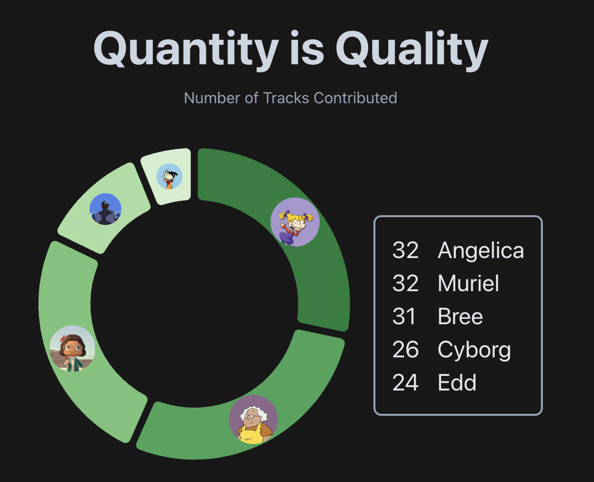
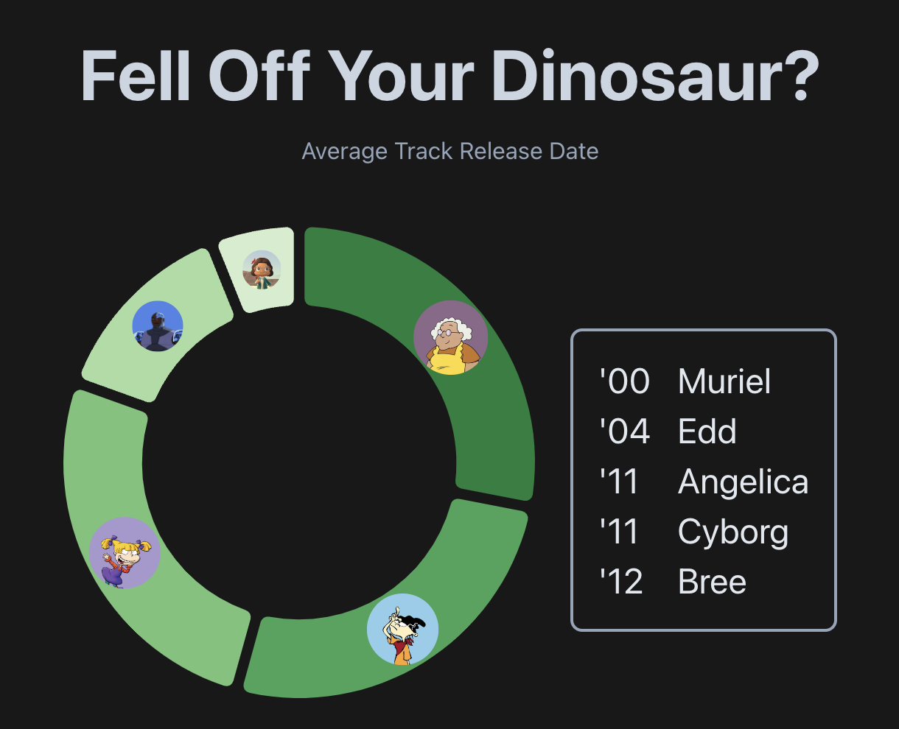

# Family Jamz

Ever wonder who's the 'old soul' of the group? Well if music taste is 
any indication, here you can find out by analyzing your shared Spotify playlists.

Get a cheeky report of some selection habits of your friends tracks, like 
'oldest average track release date' or 'number of explicit tracks'. Compare and
reflect on what your friends contributions say about them as a person (just kidding, it's not that deep, but 
can definitely lead to some fun conversations!)

<p align="center">
  
</p>

<p align="center">
  
</p>

## Technologies Used

Alright now's the time for honesty, this was more of a learning project that just happened to be 
a fun vehicle by involving friends and family. 
Now's the part where I go on about the cool stuff contained in this project.

### Spotify API

This application uses the Spotify API (which is exceptional by the way, great work by the Spotify team!)
to access playlist and superficial user information. 

[/src/spotify](src/spotify) contains the core code for interacting with the api.
[authCodeWithPkce.ts](/src/spotify/authCodeWithPkce.ts) is 
shamelessly ripped right out of their excellent [web-api-examples](https://github.com/spotify/web-api-examples/blob/master/get_user_profile/src/authCodeWithPkce.ts) 
repository.

However, [api.ts](/src/spotify/api.ts) and associated [types.d.ts](/src/spotify/types.d.ts) is all my handiwork.
`api.ts` is your usual low level wrapper around `fetch` by wiring up basic auth token, url param generation,
and error handling (I was aware there were some libraries already available, but why not roll my own
and leave maintenance to future me?)

### Spotify API Collections

Now one interesting thing in the `api.ts` file is the `fetchAllItems` function! 
The Spotify API has a predictable response structure when the endpoint returns a collection of items. 
These endpoints respond with a structure that looks like so

```json
{
  "next": "https://api.spotify.com/v1/me/shows?offset=3&limit=3",
  "items": [ "Item 1", "Item 2", "Item 3" ]
}
```

And when there are no items, `"next"` is returned with a null value.

Therefore, you can interact with the api as if an iterator, simply checking if "next" is null
and collecting the results as you go!

Now obviously this elides the nuance of paginating content in favor of a more brutish 
"give me everything now" approach, and it's likely this is standard fare as far as APIs go.
Still, the ergonomics of such an interface was shockingly refreshing compared to some 
more... 'kitchen sink' APIs that exist out there in the enterprise world.

## To-Do

- (Long Term) Add first-class support for adding categories with 'plugin' system

## Project Setup

```sh
npm install
npm run dev
```

### Type-Check, Compile and Minify for Production

```sh
npm run build
```
